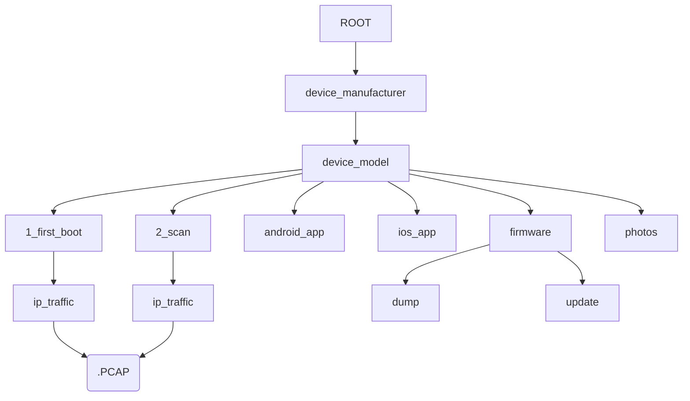

# 1. Preliminary work
## 1.1 Network setup
* Two WiFi networks;
	* Proxy-WiFi; All traffic to HTTPS-port (443) is routed to proxy-server
	* Plain-WiFi; All traffic goes directly to internet, without proxy
	* Traffic of both networks are mirrored to monitor-interfaces, for traffic capture

## 1.2 Find source documents
* User manual
* Terms and conditions
* Privacy policy
* IOS app URL
* Android app URL
* Any existings security research material

## 1.3 Document basic information
* Model
* Manufacturer / brand
* Serial number
* MAC
* IP
* Phone and capture PC MAC and IPs

# 2. Data collection

## 2.1. Disassembly and hardware enumeration
### 2.1.1 IC manufacturer identification
* https://www.retrosix.wiki/ic-manufacturer-logos
* https://www.elnec.com/en/support/other/ic-logos?method=logo/
* http://www.ecadata.de/herst/myshowlogo.php?F_SPRACHE=2
* https://componentstash.com/reference/semiconductor-logos

## 2.2. First boot
1) Try to identify serial port, to capture boot log during first boot
2) Download mobile app to phone and dump it
	1) Android: `adb shell pm list packages` & `adb pull`
  2) iOS: `` 
3) Start capturing network traffic; 
	1) Monitor ports, mobile phone packet capture (e.g. PCAPdroid), BLE-sniffer, etc..
	2) HTTPS proxy (Burp, OWASP Zap, PCAPdroid, etc..)
4) Open note.juva.lu, note something like "Starting testing (device name)". Each action after this should be logged to Netnotes.
5) Follow manufacturer instructions for setup
	1) If device refuses to operate, it is likely that the HTTPS Proxy is causing issues with certificate pinning or other protection measures. In this case, disable HTTPS-proxy and continue testing
	2) If device uses phone to pair with network, it usually utilizes built-in WiFi access point. In this phase it is useful to capture network traffic directly from the phone (e.g. `rvictl` with iOS/macOS or PCAPdroid in Android)
6) Record which legal documents user needs to read and agree with
7) While registering account, take notes of password complexity and required user information
8) Use device as intended, record the intended usage and take pictures of the app/device
9) After some time of normal usage, remove device from account and delete user account. Follow any instructions given by the manufacturer to delete all user data.
10) If possible, dump device memory. 
	1) Record any findings related to non-deleted personal- or security-information
11) Check that deleted device disconnected from network and does not join the network again

## 2.3. Re-pairing and scan
1) Register account again in mobile app. Record if some data persist from previous session
2) Pair device again with mobile phone. Record if the device remembers wifi-credentials
3) Scan device using suitable tools, like nmap, Burp or Nessus
4) Remove device from account again.
5) Remove account again.
6) Try to dump memory again. Record if there is any difference in relation to previous memory dump

## 2.4. Clean up collected data
1) Merge pcaps into two files: app- and WiFi-traffic
2) Filter out all non-relevant packets from the merged pcaps (e.g. packets captured from wifi monitor)

## 2.5 Commands for data collection

### Capture packets from local network interface
```
tcpdump -i en5 -W 3000 -C 50 -w 1_lab_wifi_monitor.pcap
```

### Merge collected pcaps
```
mergecap -w 1_wifi_traffic.pcap 1_lab_wifi_monitor.pcap000*
```

### Repair pcap
In some cases, pcap recording may be interrupted, leading into pcap file that has been cut in the middle of a packet. To repair it, run editcap:
```
editcap 1_ios.pcap0000 1_ios.pcap0000
```

### Extract packets only sent/received by specific IP
When recoding packets from WiFi access point, you might end up with a lot of irrelevant packets. Here is how to filter out all of those connections, if you know the target device IP address (in this example, ip-address is 192.168.1.55):
```
tshark -nnr input.pcap -Y "ip.addr == 192.168.1.55" -w output.pcap
```

If you know the target device MAC-address, similar filtering can be done:
```
tshark -nnr input.pcap -Y "eth.addr == AA:BB:A1:31:45:BC" -w output.pcap
```

### Get android app using ADB
```
> adb shell pm list packages | grep [software name]
package:com.package.name

> adb shell pm path com.package.name
package:/data/app/~~l8aXkje66aSpfpJfnl7RhA==/com.package.name-hTMBaTC3LUoVs7XWjUR5cA==/base.apk
package:/data/app/~~l8aXkje66aSpfpJfnl7RhA==/com.package.name-hTMBaTC3LUoVs7XWjUR5cA==/split_config.arm64_v8a.apk
package:/data/app/~~l8aXkje66aSpfpJfnl7RhA==/com.package.name-hTMBaTC3LUoVs7XWjUR5cA==/split_config.xxhdpi.apk
package:/data/app/~~l8aXkje66aSpfpJfnl7RhA==/com.package.name-hTMBaTC3LUoVs7XWjUR5cA==/split_install_time_packet.apk

> adb pull /data/app/~~l8aXkje66aSpfpJfnl7RhA==/com.package.name-hTMBaTC3LUoVs7XWjUR5cA==/base.apk
/data/app/~~l8aXkje66aSpfpJfnl7RhA==/com.package.name...: 1 file pulled, 0 skipped. 94.8 MB/s (73910697 bytes in 0.744s)
```

### Get PCAPdroid packet capture using ADB
```
> mkdir ip_traffic
> cd ip_traffic 
> adb pull /sdcard/Download/PCAPdroid/PCAPdroid_XX_YY_ZZ.pcapng
```

### Get ios app using frida dump
**Use jailbroken iPhone, for example palera1n in rootless-mode**
```
git clone git@github.com:AloneMonkey/frida-ios-dump.git
iproxy 2222 22 &
frida-ps -Uia
./dump.py -p 2222 -H localhost com.package.name
```
## Folder structure for data collection



# 3. Analysis

## 3.1. Analysis of network interfaces
* Burp
* Nessus
* nmap

## 3.2. Automated analysis of collected network traffic
* PcapMapper: https://github.com/Zokol/pcapMapper

**Notice:** *It is also possible to use the batch_run.py with JSON template from batch_run_template.json to make analysis more streamlined*

1) Create report for device traffic
```
python main.py --dut_name <device_name> --ip <dut_ip_address> --pcap_file <path_to_device_pcap_file> --output <path_to_device_report_output_file>   
```
2) Create report for app traffic
```
python main.py --dut_name <device_name> --ip <phone_ip_address> --pcap_file <path_to_app_pcap_file> --output <path_to_app_report_output_file>   
``` 
If app traffic record is already restricted to the correct process (like you can do in PCAPdroid), you can leave out IP or MAC filtering:
```
python main.py --dut_name <device_name> --pcap_file <path_to_app_pcap_file> --output <path_to_app_report_output_file> 
```
3) Collect all reports of one device category into single folder
4) Visualize reports of device category
```
python report_visualizer.py --path <path_to_report_folder>
```
## 3.3. Manual analysis of collected network traffic
1) List domains from DNS-queries: `tshark -n -T fields -e dns.qry.name -R "ip.src == $DUT_IP && dns.flags.response eq 0" -2 -r $PCAP_FILE | sort | uniq`
2) List IP:s DUT sends data to: `tshark -n -T fields -e ip.dst -R "ip.src == $DUT_IP" -2 -r $PCAP_FILE | sort | uniq`
3) List IPs DUT recevies data from: `tshark -n -T fields -e ip.src -Y "ip.dst == $DUT_IP" -2 -r $PCAP_FILE | sort | uniq`
4) List countries where these IPs are located: 
5) List number of packets sent in HTTPS vs. HTTP: `tshark -r $PCAP_FILE -Y "http && ip.src == $DUT_IP" | wc -l; tshark -r $PCAP_FILE -Y "ssl && ip.src == $DUT_IP" | wc -l`
6) List number of bytes sent in HTTPS vs. HTTP: `tshark -r $PCAP_FILE -Y "http && ip.src == $DUT_IP" -T fields -e frame.len | awk '{s+=$1} END {print s}'; tshark -r $PCAP_FILE -Y "ssl && ip.src == $DUT_IP" -T fields -e frame.len | awk '{s+=$1} END {print s}'`
7) List IPs that receive HTTP-traffic: `tshark -r $PCAP_FILE -Y "http && ip.src == $DUT_IP" -T fields -e ip.dst | sort | uniq`
8) List all packets that contain HTTP authentication: `tshark -r $PCAP_FILE -Y "http.authorization && ip.addr == $DUT_IP"`
9) List number of bytes sent in various protocols: 
10) Any credentials found in traffic?
11) Any vulnerable encryption detected? (how?)

### 3.3.1. HTTP vs. HTTPS

Amount of packets in http vs. https:
```
tshark -r 1_lab_network_monitoring.pcap0000 -Y 'http' | wc -l
92282

tshark -r 1_lab_network_monitoring.pcap0000 -Y 'ssl' | wc -l
48054
```

### 3.3.2. Protocol stats

```
PROTOCOLS = ("http", "ssl", "ftp", "smtp", "pop3", "imap", "telnet", "mqtt", "snmp", "ldap", "ssh")

for PROTOCOL in "${PROTOCOLS[@]}"; do
	echo "$PROTOCOL"
	tshark -r $PCAP_FILE -Y "$PROTOCOL && ip.src == $DUT_IP" -T fields -e frame.len
done
```

## 3.4. Analysis of memory dump
1) Run EMBA
2) Search for user name, email, password and wifi-credentials with string
3) Is there any hints for who produced the software?

## 3.5. Analysis of legal documents
(update this list with AI prompts used in testing)
1) Process legal documents with AI-models
2) List possible flagged paragraphs related to collection of personal information and how the contract can be utilised to collect, use and sell personal information of users.
